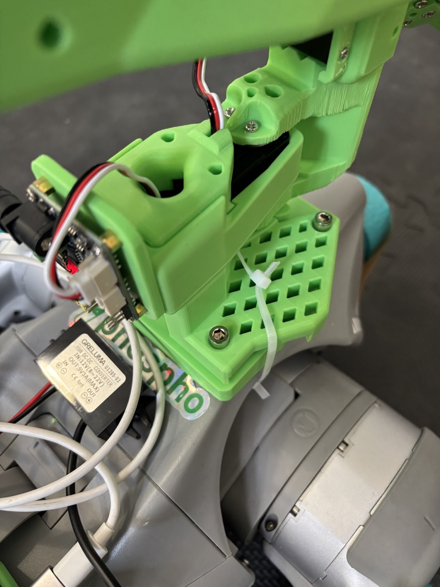
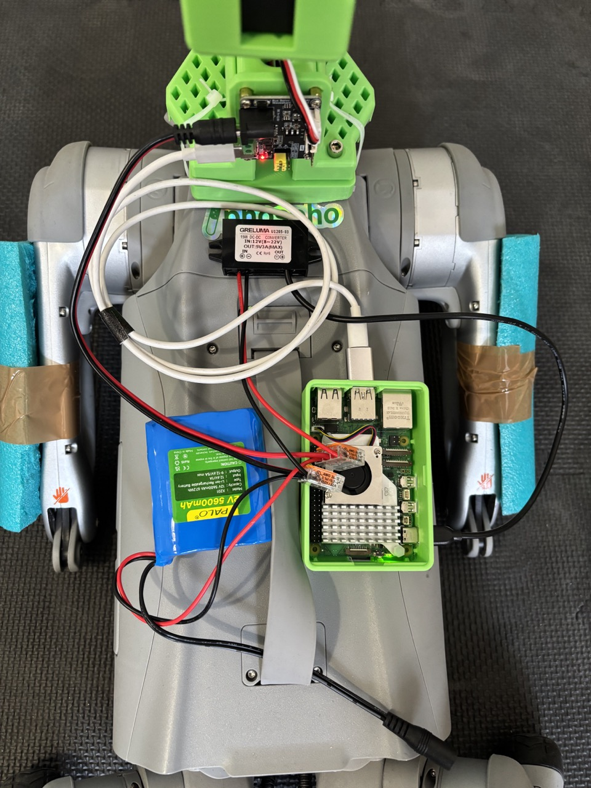
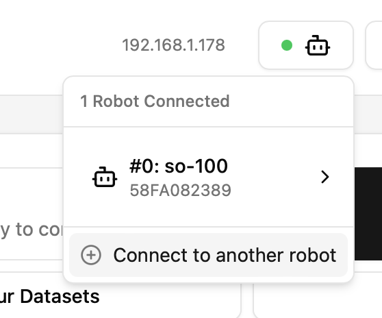
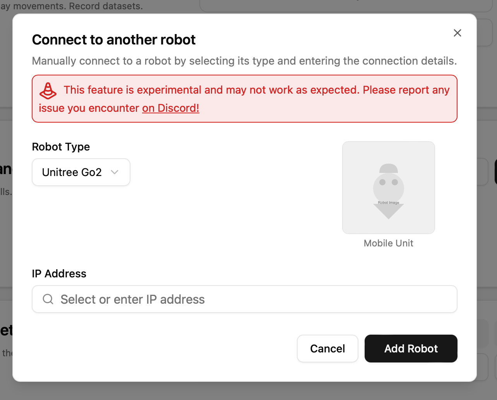

# LeCabot by phospho🧪

phospho is introducing **LeCabot.** A mobile manipulator mod for the SO-100 robot arm and the Go2 robot dog, controlled with a Meta Quest thanks to [phosphobot.](https://github.com/phospho-app/phosphobot)

An open source and low cost alternative to Spot by Boston Dynamics.

Star this repo and start building!

https://github.com/user-attachments/assets/81b7ce8c-6983-4b87-94b9-16b3c4670b92

# Bill of Materials

| Part                                                                | Amount |                                Unit Cost (US)                                 | Buy (US)                                                                                                                                                                      | Unit Cost (EU) | Buy (EU)                                                                                                  | Unit Cost (CN) | Buy (CN)                                                                                                  |
| :------------------------------------------------------------------ | :----: | :---------------------------------------------------------------------------: | :---------------------------------------------------------------------------------------------------------------------------------------------------------------------------- | :------------: | :-------------------------------------------------------------------------------------------------------- | :------------: | :-------------------------------------------------------------------------------------------------------- |
| Raspberry Pi 5 (4GB)                                                |   1    |                                    \$60.00                                    | [Adafruit](https://www.adafruit.com/product/5812)                                                                                                                             |     €57.00     | [Mouser](https://eu.mouser.com/ProductDetail/Raspberry-Pi/SC1111?qs=HoCaDK9Nz5fnLhlMNnKTiQ%3D%3D)         |      ¥410      | [Taobao](https://e.tb.cn/h.64IIvlisvAL15g8?tk=fdOVexkHECW)                                                |
| 12V 5A Battery                                                      |   1    |                                    \$32.99                                    | [Amazon](https://www.amazon.com/KBT-Rechargeable-Connector-Replacement-Security/dp/B0C242DYT1/ref=sr_1_2_sspa?)                                                               |     €45.79     | [Amazon](https://www.amazon.fr/dp/B0D5QSMW21)                                                             |      ¥70       | [Taobao](https://e.tb.cn/h.64IJNTnXwhn44BS?tk=PQQ8exkJEtR)                                                |
| Lever Wire Connector                                                |   1    |                                    \$6.70                                     | [Amazon](https://www.amazon.com/Wago-221-413-LEVER-NUTS-Conductor-Connectors/dp/B06XGYXVXR/ref=sr_1_4)                                                                        |     €7.18      | [Amazon](https://www.amazon.fr/221-413-fil-%C3%A9lectrique-connecteur-220-240-Terminal/dp/B01AKF3I58)     |     ¥3.50      | [Taobao](https://e.tb.cn/h.64r0Z6Y5jZczq5q?tk=XEaSex908q0)                                                |
| 12V 5A DC plug connector                                            |   1    |                                    \$9.49                                     | [Amazon](https://www.amazon.com/43x2pcs-Connectors-Security-Lighting-MILAPEAK/dp/B072BXB2Y8/ref=sr_1_11)                                                                      |     €8.99      | [Amazon](https://www.amazon.fr/RUNCCI-YUN-Alimentation-dalimentation-Connecteur-Surveiller/dp/B0CX44HTKZ) |     ¥3.10      | [Taobao](https://e.tb.cn/h.64IFOvrMdUVoQQX?tk=nahtexkvokE)                                                |
| 12V to 5V 5A USB-C converter                                        |   1    |                                    \$9.99                                     | [Amazon](https://www.amazon.com/Klnuoxj-Converter-Interface-Waterproof-Compatible/dp/B0CRVW7N2J?source=ps-sl-shoppingads-lpcontext&ref_=fplfs&smid=A1QRG6NHEUKUZO&gQT=0&th=1) |     €9.99      | [Amazon](https://www.amazon.fr/Greluma-convertisseur-Adaptateur-dalimentation-Compatible/dp/B0D7VDL2X6)   |      ¥20       | [1688](https://qr.1688.com/s/Eb6ykv4y)                                                                    |
| M5 × 30 mm Screw Kit                                                |   1    |                                    \$8.99                                     | [Amazon](https://www.amazon.com/Mywish-50Sets-Stainless-Washers-Spanner/dp/B0DJP888H2)                                                                                        |     €15.83     | [Amazon](https://www.amazon.fr/hexagonale-inoxydable-Entièrement-Fileté-Boulons/dp/B08RN8QY5J?th=1)       |      ¥24       | [Taobao](https://za.meest-shop.com/en/taobao/product/717340363892)                                        |
| **Cable Zip Ties**                                                  |   1    |                                    \$6.99                                     | [Amazon](https://www.amazon.com/Self-Locking-CableTies-Multi-Purpose-Management-Workshop-White/dp/B097M825XG)                                                                 |     €8.99      | [Amazon](https://www.amazon.fr/C%C3%A2ble-Plastiqu-Nylon-Attaches-4-8X300MM/dp/B0C8RDM2F4/)               |     ¥21.50     | [Alibaba (CN)](https://www.alibaba.com/product-detail/BSCI-Approved-Factory-3-6-200mm_1600754572203.html) |
| Unitree Go2 (Air, Edu, or Pro)                                      |   1    | [Official Unitree Store](https://shop.unitree.com/en-fr/products/unitree-go2) |                                                                                                                                                                               |                |                                                                                                           |                |                                                                                                           |
| [12V SO-100 or SO-101](https://github.com/TheRobotStudio/SO-ARM100) |   1    |      Get your dev kit on [robots.phospho.ai](https://robots.phospho.ai)       |                                                                                                                                                                               |                |                                                                                                           |                |                                                                                                           |
| **Total**                                                           |        |                                 **\$135.15**                                  |                                                                                                                                                                               |  **€153.77**   |                                                                                                           |  **¥552.10**   |                                                                                                           |
|                                                                     |

> [!NOTE]
> Prices and items may vary depending on geographic location and time of purchase.

# 3D Printing

1. Print the [SO-100 mount for the Go2](./3DPrintMeshes/SO-100_Go2_Mount.stl), made by [the golden-robot-retriever team](https://github.com/DominiquePaul/golden-robot-retriever) and Philipp from Mimic.
2. Drill holes with a 5mm drill through the SO-100 mount for the Go2.
3. Print the [Raspberry Pi 5 case](./3DPrintMeshes/RPi-5_case_slim_port.stl).

# Assembly

## 1. Assemble the mount

1. Attach the SO-100 to the SO-100 mount for the Go2 using the M5 30mm screws.
2. Attach the SO-100 mount to the Go2 using multiple cable zip ties tied together.
3. Put the raspberry pi in the case.



## 2. Assemble the Battery pack

The battery pack in the bill of material is made for a 12V SO-100, and uses a converter to connect the raspberry pi to a 5V signal.

1. Get **the 12V battery, the DC plug, the USB-C converter, and two lever wire connectors.**

2. Plug the three black cables into a **lever wire connector.** Plug the three red cables into another **lever wire connector.**

   > Caution: the metal parts of the wires must be in contact with the metal parts of the connectors! You may need to strip the wires.

3. Connect the SO-100 to the 12V DC plug, and connect the raspberry pi to the 5V USB-C power cable.

4. Connect the SO-100 to the raspberry pi using the USB-C to USB-A cable.

5. Once you tested that everything works well, use some good old duct tape to attach all the parts on the Go2.



# Setup

1.  Install phosphobot on your raspberry pi. [See the full tutorial here.](https://docs.phospho.ai/installation#setup-your-raspberry-pi)

    ```bash
    curl -fsSL https://raw.githubusercontent.com/phospho-app/phosphobot/main/install.sh | sudo bash
    ```

2.  Install the [Meta Quest app phospho teleoperation.](https://www.meta.com/en-gb/experiences/phospho-teleoperation/8873978782723478/) It's compatible with Meta Quest 2, Pro, 3, and 3s.

3.  Plug everything together. Start your raspberry pi 5. The phosphobot dashboard is accessible on `<YOUR LOCAL RPI IP>:80` in your browser. The SO-100 robot arm should be automatically detected.

4.  Turn on the Unitree Go2 by pressing the button, and wait for it to stand up.

5.  In the phosphobot dashboard, click in the top right on the robot head, then click on "Connect to another robot".

    

    Select Unitree Go2, then select or enter the IP address of the Unitree. Finally, click on the Add Robot button.

    

    > _Tip: The MAC address of the Unitree often starts with `78:22:88`. You can also use the Unitree mobile app to discover the IP and MAC address of your Go2. Make sure the Unitree remote controler and Unitree mobile app are disconnected._

6.  Start the Meta Quest app and select your phosphobot server in the list. [See here for a full tutorial](https://docs.phospho.ai/examples/teleop).

7.  Press A to start the teleoperation. Move the robot dog with the right joystick. Move the SO-100 by moving your arm around. Have fun!

---

Share your demos and tag [our twitter account](https://x.com/phospho_ai) so we can repost you!

Join our [Discord server](https://discord.gg/cbkggY6NSK) to keep the conversation going.

Made with 💚 by the Phospho community
